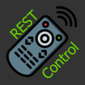
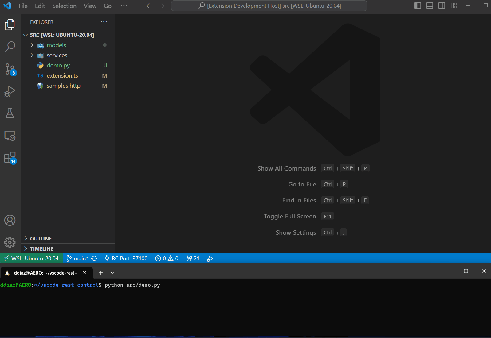
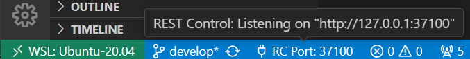
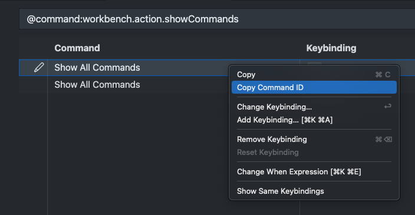

<p align="center">
  <a href="https://marketplace.visualstudio.com/items?itemName=dpar39.vscode-rest-control">
    
  </a>
</p>

<p align="center">
  <a href="https://marketplace.visualstudio.com/items?itemName=dpar39.vscode-rest-control" title="Check it out on the Visual Studio Marketplace">
    
  </a>

  

  <a href="https://www.buymeacoffee.com/dpar39" title="Buy me a coffee" style="margin-left:10px">
    
  </a>
</p>

This extension allows you to remotely control instances of Visual Studio Code by exposing a REST endpoint that you can use to invoke vscode commands. In the background it launches a HTTP server that listen on the `localhost` interface for requests of commands to execute.

The demo below shows how we can open a terminal, run some commands in it, then close all terminals, open a file with the cursor in a specified location and finally start a debug session on the same file that is orchestrating it all!



**DISCLAIMER: This extension was forked from [Remote Control](https://github.com/estruyf/vscode-remote-control).**
The main motivation behind it was that while `Remote Control` uses `websockets`, for my use case I can only rely on HTTP REST calls. In addition, some commands I need to use require non-primitive JavaScript types which are not handled except for a couple of cases in the original extension (e.g. the `Uri` for `vscode.open` command).

## Extension Settings

The extension has the following settings which you can use to configure it:

- `restRemoteControl.enable`: enable/disable this extension
- `restRemoteControl.port`: set the port number on which the HTTP server will listen
- `restRemoteControl.fallbacks`: an array of port numbers to fallback to if the port is already in use.

## Usage

When you install this extension, it will automatically try to start a HTTP server on port `37100`. This port can be changed on in the VSCode settings. When you are going to use multiple VSCode sessions at the same time, it is best to configure it on workspace level or use the `restRemoteControl.fallbacks` setting to specify fallback ports when the previous one is already in use. VSCode terminals opened will have environment variable `REMOTE_CONTROL_PORT` set with the port the server is currently listening to.




Once installed, you can execute vscode `commands` by making HTTP requests. Here are few examples using `curl`:

```bash
# Create a new terminal
curl -X POST http://localhost:37100 -d '{"command":"workbench.action.terminal.new"}'

# Run `pwd` in the currently active terminal
curl -X POST http://localhost:37100 -d '{"command":"custom.runInTerminal", "args": ["pwd"]}'

# Kill all terminals
curl -X POST http://localhost:37100 -d '{"command":"workbench.action.terminal.killAll"}'
```

All requests are expected to be in a JSON HTTP request body in the form:
```json
{
  "command": "<command-id>",
  "args": ["<arg1>", "<arg2>", "...", "<argN>"]
}
```

Some VSCode commands expect VSCode's defined types such as [Range](https://code.visualstudio.com/api/references/vscode-api#Range), [Uri](https://code.visualstudio.com/api/references/vscode-api#Uri), [Position](https://code.visualstudio.com/api/references/vscode-api#Position) and [Location](https://code.visualstudio.com/api/references/vscode-api#Location). To accommodate for those, such arguments can be passed as a special types, see the example below which effectively invokes `editor.action.goToLocations` with `Uri`, `Position` and an array of `Location`s:

```json
{
  "command": "editor.action.goToLocations",
  "args": [
    {
      "__type__": "Uri",
      "args": ["/path/to/file.py"]
    },
    {
      "__type__": "Position",
      "args": [4, 0]
    },
    [
      {
        "__type__": "Location",
        "args": [
          {
            "__type__": "Uri",
            "args": ["/path/to/file.py"]
          },
          {
            "__type__": "Position",
            "args": [11, 5]
          }
        ]
      }
    ]
  ]
}
```

### Custom defined commands:

As the extension progresses, I plan to add more _special_ commands (i.e. commands that require some use of the [VSCode API](https://code.visualstudio.com/api/references/vscode-api)). For now, we have defined the following commands:

- `custom.goToFileLineCharacter`: allows you to navigate to a specific position in a file by passing the file path, line and column number as arguments
- `custom.startDebugSession`: allows you to invoke `vscode.debug.startDebugging()` API by passing the workspace folder and a name or definition of a debug configuration as it would be set in `launch.json`
- `custom.runInTerminal`: allows you to invoke commands the currently active integrated terminal
- `custom.showQuickPick`: show quick pick dialog to collect selection from the user
- `custom.showInformationMessage`, `custom.showWarningMessage` and `custom.showErrorMessage`: show message dialogs to the user and let them click on a button
- `custom.listInstalledExtensions`: get the list of installed extension IDs
- `custom.getExtensionInfo`: get details of an installed extension by passing the extension ID

## To implement in the near future:
- Add the ability to set a breakpoint at the specified file/line combination


### How do I get the command ID?

To get the command ID, open the `Command Palette` and type `Show all commands`. This will give you a list with all the available commands. VScode's built-in commands can be found [here](https://code.visualstudio.com/api/references/commands).

Behind each command, there is a gear button. When you click on it, it brings you to the shortcut configuration. Where you can right-click on the command and copy its ID.



## Feedback / issues / ideas

Please submit your feedback/issues/ideas by creating an issue in the project repository: [issue list](https://github.com/dpar39/vscode-rest-control/issues).
